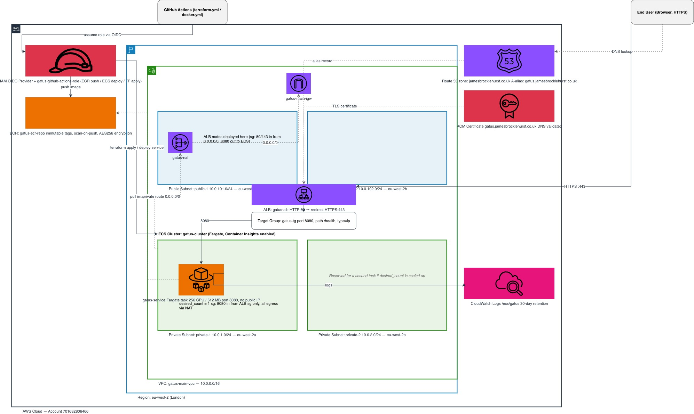
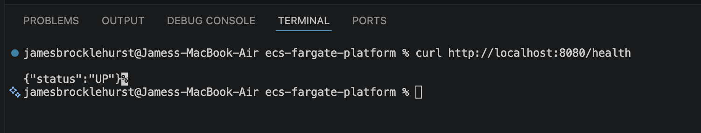
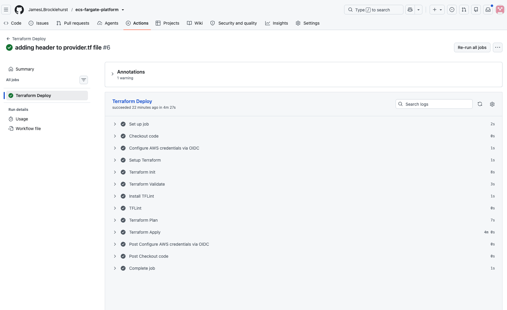
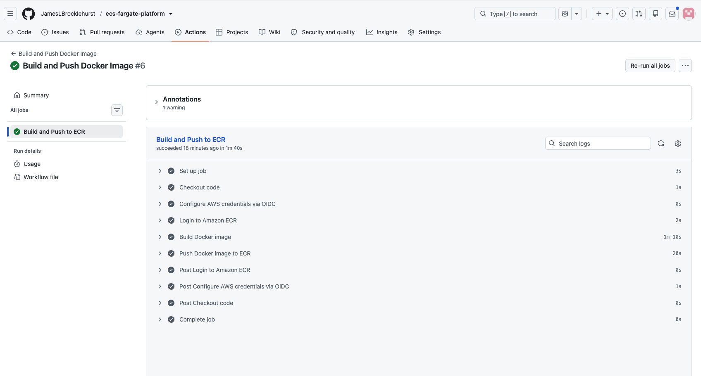
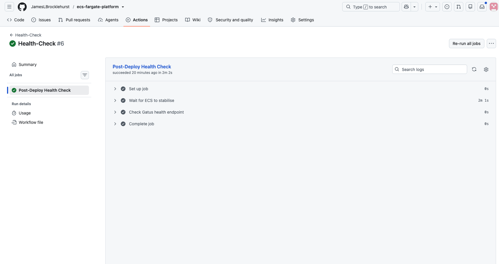

# ecs-fargate-platform - Gatus Monitoring System

Gatus Monitoring Platform on AWS

## Table of Contents

1. [Architecture](#architecture)
2. [Tech Stack](#tech-stack)
3. [Running Locally](#running-locally)
   - [Not in Docker](#not-in-docker)
   - [In Docker](#in-docker)
4. [Pipeline Evidence](#pipeline-evidence)
   - [Terraform Deploy](#terraform-deploy)
   - [Docker Image Push to ECR](#docker-image-push-to-ecr)
   - [Health Check](#health-check)
5. [Changes](#changes)
   - [Removing the Gatus sub-repo in favour of `go install`](#removing-the-gatus-sub-repo-in-favour-of-go-install)
   - [Running Locally (new approach)](#running-locally-new-approach)

## Architecture



The diagram covers the VPC, public/private subnets across two AZs, the ALB and target group, the ECS Fargate service, ECR, ACM/Route 53, CloudWatch Logs, and the GitHub Actions OIDC deploy path.

## Tech Stack

- **AWS ECS Fargate** — runs the Gatus container
- **AWS ECR** — stores the built container image
- **AWS ALB** — public load balancer in front of ECS
- **AWS ACM** — TLS certificates for the ALB
- **AWS Route 53** — DNS for the application hostname
- **AWS VPC** — networking (public/private subnets)
- **AWS IAM OIDC** — federated auth for GitHub Actions, no long-lived AWS keys
- **Terraform** — infrastructure as code, modular by service (ACM, ALB, ECR, ECS, GitHub Actions, Route 53, VPC)
- **S3 + DynamoDB** — remote Terraform state storage and state locking
- **Docker** — multi-stage build, `golang:alpine` builder → `distroless/static:nonroot` runtime
- **Go** — Gatus is built and installed via `go install`
- **Gatus** — the monitoring/health-check application being deployed
- **GitHub Actions** — CI/CD pipelines for Terraform and Docker
- **TFLint** — Terraform linting in CI

## Running Locally

### Not in Docker

**Prerequisites**

- [Go](https://golang.org/dl/) 1.26 or higher
- Git (to initialise the submodule)

To verify your Go version:

```bash
go version
```

**Setup**

If you have just cloned this repo, initialise the submodule first:

```bash
git submodule update --init
```

**Run the application**

```bash
cd gatus
make run
```

The application will be available at `http://localhost:80`.

On first run, Go will download the required dependencies automatically. This may take a minute.

**Verify the application is running**

Once the application is running, confirm it is healthy by running the following command in a separate terminal:

```bash
curl http://localhost:80/health
```

You should see the following response:

```json
{"status":"UP"}
```



**Configuration**

The application is configured via `gatus/config.yaml`. Edit this file to add or change the endpoints you want to monitor.

**Stopping the application**

Press `Ctrl + C` in the terminal where the application is running.

---

### In Docker

**Prerequisites**

- [Docker](https://docs.docker.com/get-docker/) installed and running

**Build the image**

Run this from the repo root:

```bash
docker build -f docker/gatus/dockerfile -t gatus:local ./gatus
```

**Run the application**

```bash
docker run -d -p 80:8080 --name gatus gatus:local
```

The application will be available at `http://localhost:80`.

**Verify the application is running**

Once the container has started, confirm it is healthy by running the following command:

```bash
curl http://localhost:80/health
```

You should see the following response:

```json
{"status":"UP"}
```

To check the container is running and view recent logs:

```bash
docker ps --filter name=gatus
docker logs gatus
```

**Stopping the application**

```bash
docker stop gatus
```

To start it again without rebuilding:

```bash
docker start gatus
```

---

## Pipeline Evidence

### Terraform Deploy



### Docker Image Push to ECR



### Health Check



---

## Changes

### Removing the Gatus sub-repo in favour of `go install`

**What is changing**

The `gatus/` directory was previously a Git submodule containing the full Gatus source tree. The `Dockerfile` built the binary by copying that source into the image and running `go build` against it locally. This is being replaced with a single `go install` call directly inside the `Dockerfile`, pulling the pinned upstream release from GitHub at build time — no local source copy required.

**Why this change is being made**

- **Smaller repository** — carrying the entire Gatus source tree (source files, tests, docs) inflated the repo size and git clone time with code that is never modified.
- **Simpler version management** — upgrading Gatus now requires changing one version tag in the `Dockerfile` (`@v5.36.0` → `@v5.37.0`) rather than manually updating a submodule.
- **Better separation of concerns** — configuration (`config.yaml`) is decoupled from the image build, which is the correct pattern for ECS where config is injected at runtime. Config changes no longer require a full image rebuild.
- **Smaller binary** — the new build uses `-ldflags="-s -w"` to strip debug symbols, reducing the final binary size.
- **Reproducible pinning** — the version tag in `go install` ensures the same binary is produced on every build, matching the reproducibility of the previous `go.sum`-locked approach without the overhead of vendoring the source.

---

### Running Locally (new approach)

#### Not in Docker

> **Note:** The steps above (using `git submodule update --init` and `cd gatus && make run`) reflect the previous sub-repo approach and are kept for reference. The new approach is documented below.

**Prerequisites**

- [Go](https://golang.org/dl/) 1.21 or higher (no submodule initialisation needed)

**Install and run the application**

```bash
go install github.com/TwiN/gatus/v5@v5.36.0
```

Then run the installed binary, pointing it at your config file:

```bash
GATUS_CONFIG_PATH=gatus/config.yaml gatus
```

The application will be available at `http://localhost:80`.

**Verify the application is running**

```bash
curl http://localhost:80/health
```

You should see:

```json
{"status":"UP"}
```

---

#### In Docker

> **Note:** The Docker build steps above (using `docker build -f docker/gatus/dockerfile -t gatus:local ./gatus`) reflect the previous sub-repo approach and are kept for reference. The new approach is documented below.

**Build the image**

Run this from the repo root:

```bash
docker build -t gatus:local .
```

**Run the application**

Mount your config file at runtime so config changes do not require a rebuild:

```bash
docker run -d -p 80:8080 \
  -v $(pwd)/gatus/config.yaml:/config/config.yaml \
  -e GATUS_CONFIG_PATH=/config/config.yaml \
  --name gatus gatus:local
```

The application will be available at `http://localhost:80`.
